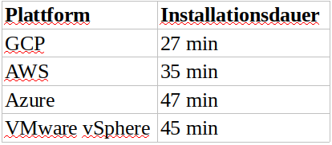

Der Blog ist aufgeteilt in drei Themen:

**1. Installations-Pitfalls:** In der /mid Week haben wir OpenShift 4.2 sowohl auf einem VMware vSphere Cluster wie auch bei AWS, GCP und Azure installiert. Wir berichten über die Probleme, die dabei aufgetaucht sind.

**2. Networking:** Je nach Cloud Plattform gibt es logischerweise Unterschiede (z.B. Load Balancer). Wir haben aber auch Unterschiede zwischen OpenShift 3.11 und 4.2 festgestellt.

**3. Storage:** Jeder Cloud Provider bietet diverse Typen von Storage zur Integration in OpenShift an. Wir zeigen euch, was es für Möglichkeiten gibt.

**1. Installation Pitfalls**

Wenn du in diesem Blog nach einer Anleitung suchst, wie OpenShift 4.2 installiert wird, bist du leider falsch. Für die Installationen haben auch wir die offiziellen [Anleitungen von Red Hat](https://docs.openshift.com/container-platform/4.2/welcome/index.html) verwendet.

Vorneweg: Die Installation wird mit OpenShift Version 4.2 deutlich einfacher und schneller als mit 3.11. Generell - egal für welche Zielplattform - haben wir Folgendes festgestellt:

Kleinere Umgebungen als 3 Master / 3 Node (Standardvorgabe) sollten nicht gewählt werden. Es wird sehr langsam oder die Installation schlägt teilweise sogar fehl. 
Für den OpenShift Installer wird ein _install-config.yaml_ File erstellt. Dies sollte vor Beginn der Installation gesichert werden, da der Installer dieses anschliessend löscht.
Weiter sollten auch alle Terraform Output Files gesichert werden, damit später der Cluster einfach gelöscht werden kann. Achtung, beim Löschen des Cluster erfolgt keine zusätzliche Bestätigung!
Je nach Plattform haben wir unterschiedliche Grössen der Standard-VM festgestellt.
Wenn [während der Installation](https://docs.openshift.com/container-platform/4.2/installing/installing_aws/installing-aws-customizations.html#ssh-agent-using_install-customizations-cloud) kein SSH-Keyfile angegeben wurde, kann anschliessend nicht auf die VM's per SSH zugegriffen werden.
Die Installation eines Clusters dauert je nach Plattform unterschiedlich lang:

**VMware vSphere**

Einige Bemerkungen zur VMware vSphere Installation:

Die Dokumentation zur Installation war sehr gut und wir konnten dieser Schritt für Schritt folgen.
Während der (ersten) Installation mussten wir feststellen, dass Reverse DNS Einträge zwingend notwendig sind. Die Installation war blockiert und wir mussten von neuem beginnen.
Kleine Fehler in den Ignition (JSON) Files führen zu Fehler, die leider sehr schwer zu finden sind, da keine sinnvolle Fehlermeldung vorhanden ist. So hat uns z.B. ein fehlendes Komma etwa eine Stunde Zeit gekostet. Ignition Files können [hier](https://coreos.com/validate/) validiert werden.
Für die Installation muss ein Load Balancer (z.B. HAproxy) erstellt werden. Siehe auch unten im Teil zu Networking.
Infrastructur MachineSets für vSphere sind noch nicht implementiert. Daher ist die Installation auf VMware vSphere auch eine [User Provisioned Infrastructure (UPI)](https://blog.openshift.com/openshift-4-install-experience/) Installation.
**GCP**

Damit die Installation auf GCP funktioniert, müssen die folgenden APIs aktiviert sein:

Identity and Access Management(IAM)
Cloud Resource Manager API
Weiter muss die Disksize Limit von 500GB auf 750 GB erhöht werden (640GB benutzt nach der Installation). Das Definieren im _install-config.yaml_ File des OpenShift Installer funktioniert leider nicht:

```
platform:
   gcp:
      rootVolume:
      iops: 4000
      size: 50
      type: io1
   type: n1-standard-4
```

**Azure**

Einige Bemerkungen zur Installation auf Azure:

Free Tier Subscription reicht nicht aus für eine OpenShift Installation.
Es müssen Anpassungen an den default Azure Account Limits gemacht werden.
Zürich befindet sich z.Z. nicht unter den supported Azure Regions.
Die Dokumentation ist falsch bzgl. _Azure account limits & Creating a service principal_.
**AWS**

Die Installation auf AWS war am einfachsten. Das liegt wohl daran, dass bereits Openshift 4.0 darauf ausgelegt war.

**2. Networking**

**Load Balancing**

Für eine Red Hat OpenShift 4.2 Installation werden zwei Load Balancer vor dem Cluster benötigt:

**API Load Balancer:** Für eine Hochverfügbarkeit der Kubernetes-API (welche auf dem Master läuft), müssen alle API Calls an diese Master Nodes verteilt werden.
Auf den drei Cloud Provider konnten wir dafür jeweils den Load Balancer Service des Providers verwenden. Dieser wird mit dem OpenShift Installer automatisch konfiguriert. Auf VMware vSphere mussten wir dafür selber einen Load Balancer konfigurieren. Wir haben dafür eine CentOS VM mit HAProxy verwendet. Für die hohe Verfügbarkeit kann z.B. keepalived verwendet werden.

**Client Access Load Balancer:** Für den Zugriff auf den Applikation Workload wird ein Load Balancer benötigt, der die Ingress Controller weiterleitet.
Für den Client Access Load Balancer kann auf die Cloud Provider Integration von Kubernetes zurückgegriffen werden. Damit werden mit Hilfe eines [Kubernetes Services vom Typ Load Balancer](https://kubernetes.io/docs/concepts/services-networking/service/#
lancer) automatisch ein Load Balancer auf der entsprechenden Cloud Plattform provisioniert.

Bei der on-premise Installation mit VMware vSphere muss der Load Balancer selber implementiert werden, welcher den Netzwork Traffic auf die Ingress Controller weiterleitet. Das automatische Erstellen des Load Balancers via Kubernetes Service funktioniert hier leider nicht.

**Egress Traffic & NetworkPolicy**

**NetworkPolicy:**Die Kubernetes v1 NetworkPolicy Features sind in OpenShift 4.2 verfügbar
**Egress IP:** Identisch zu OpenShift 3.11. [(Referenz)](https://docs.openshift.com/container-platform/4.2/networking/openshift-sdn/assigning-egress-ips.html)
**EngressNetworkPolicy** wir auf OpenShift 4.2 nicht unterstützt 
**EgressRouter** wird auf OpenShift 4.2 nicht unterstützt 
**3. Storage**

Abschliessend schauen wir uns noch die diversen Storage Integrationen für OpenShift 4.2 an. Wir teilen Storage in drei Kategorien ein: Block Storage, File Storage und Object Storage.

**Black Storage**

Erfreulicherweise hatten wir mit keinem Provider (onpremise wie auch Cloud) Probleme. Nach der Installation gemäss Anleitung konnten wir Block Storage von allen Cloud Providern beziehen. Alle Infos dazu sind in der entsprechenden Dokumentation von Red Hat zu finden.

[GCP](https://docs.openshift.com/container-platform/4.2/storage/persistent-storage/persistent-storage-gce.html)
[Azure](https://docs.openshift.com/container-platform/4.2/storage/persistent-storage/persistent-storage-azure.html)
[AWS](https://docs.openshift.com/container-platform/4.2/storage/persistent-storage/persistent-storage-aws.html)
[vSphere](https://docs.openshift.com/container-platform/4.2/storage/persistent-storage/persistent-storage-vsphere.html)
**File Storage**

Als File Storage bezeichnen wir solchen, der insbesondere shared bezogen werden kann [(ReadWriteMany - RWX)](https://kubernetes.io/docs/concepts/storage/persistent-volumes/#access-modes").

**AWS**

Auf AWS steht uns [EWS](https://aws.amazon.com/efs/) zur Verfügung, dabei haben wir jedoch Folgendes festgestellt:

Auf EFS sind alle Volumes nur Subfolder des Root Volume.
Quotas können nicht forciert werden.
Keine Usage Metrics
_size_ in einem PVC wird nicht berücksichtigt.
Red Hat sagt zu EFS: _"Elastic File System is a Technology Preview feature only.[...]"_[Openshift doc on EFS](https://docs.openshift.com/container-platform/4.2/storage/persistent-storage/persistent-storage-efs.html)
upstream efs-provisioner: [detailed doc & code](https://github.com/kubernetes-incubator/external-storage/tree/master/aws/efs)
Weiter kann auch Netapp Trident verwendet werden. In unserer /mid Week haben wir dies jedoch nicht angeschaut (auch nicht auf den anderen Cloud Provider Plattformen). Dafür wird ein AWS Account mit konfiguriertem NetApp CVS (1TB / 100$ / Monat) benötigt. Infos dazu in der [Netapp Trident Dokumentation](https://netapp-trident.readthedocs.io/en/stable-v19.07/kubernetes/operations/tasks/backends/cvs_aws.html).

**Azure**

Microsoft bietet mit Azure File die Möglichkeit, dynamisch File Storage zu beziehen. Die folgenden Features werden dabei aber nicht supported.

Symlinks
Hard links
Extended attributes
Sparse files
Named pipes
Alle Informationen dazu sind in der [Red Hat OpenShift Dokumentation](https://docs.openshift.com/container-platform/4.2/storage/dynamic-provisioning.html#azure-disk-definition_dynamic-provisioning) zu finden. Auch auf Azure kann [Netapp Trident](https://netapp-trident.readthedocs.io/en/stable-v19.07/kubernetes/operations/tasks/backends/anf.html) verwendet werden.

**GCP**

Auf GCP stehen [mehrere Möglichkeite](https://cloud.google.com/solutions/filers-on-compute-engine)n zur Verfügung.

Für [Cloud File Store kann der nfs-client-provisioner](https://cloud.google.com/community/tutorials/gke-filestore-dynamic-provisioning) verwendet weren. Auch hier können Quotas nicht forciert werden. Weiter gibt es einen nicht offiziell supporteten [CSI Treiber](https://github.com/kubernetes-sigs/gcp-filestore-csi-driver), den wir aber nicht wirklich zum Laufen gebracht haben.

Weiter kann auch hier NetApp Cloud Volumes mit Trident verwendet werden. Wir haben hierzu aber keine Dokumentation gefunden. Dies sollte aber ähnlich wie bei [AWS](https://netapp-trident.readthedocs.io/en/stable-v19.04/kubernetes/operations/tasks/backends/cvs_aws.html) seine. Weitere Infos dazu sind [hier](https://cloud.google.com/solutions/filers-on-compute-engine#netapp) zu finden.

Eine weitere Möglichkeit ist die Verwendung von [Elastifile](https://github.com/Elastifile/elastifile-provisioner) oder [Quoabyte](https://github.com/quobyte/quobyte-csi). Diese müssen aber alle lizenziert werden. Elastifile ist nur für einen eingeschränkten Kundenkreis verfügbar. Quoabyte sieht zur Zeit noch nicht wirklich Enterprise-like aus.

**VMware vSphere**

In einer on-premise VMware vSphere Umgebung muss einen File Storage Service selbst aufgebaut werden (z.B. mit [Red Hat Contrainer Storage](https://www.openshift.com/products/container-storage/) basierend auf [rook.io](https://rook.io/)).

**Object Storage**

Auch Object Storage wird von den drei Cloud Provider angeboten. Dieser wird aber in der Regeln nicht als PV in einen Pod gemounted, sondern direkt aus einer Applikation bezogen. Der Vollständigkeit halber hier eine Auflistung der Object Storage Services.

GCP mit [Google Cloud Storage](https://cloud.google.com/storage/)
AWS mit [S3](https://aws.amazon.com/s3/)
Azure mit [Azure Object Storage](https://azure.microsoft.com/en-us/services/storage/)
In einer on-premise VMware vSphere Umgebung muss ein Object Storage Service selbst aufgebaut werden.


