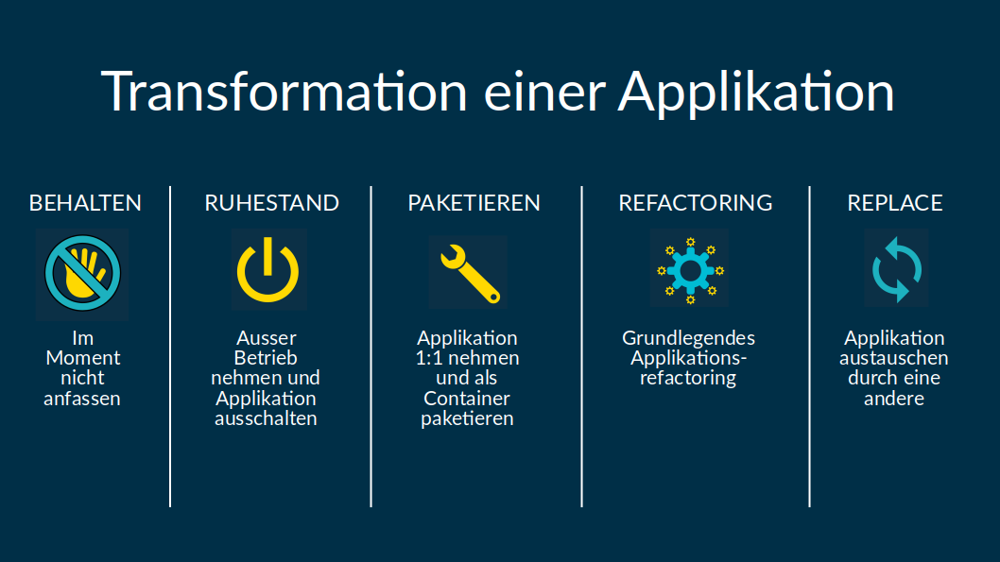

Der Testlauf begann um 09:00 Uhr und wurde von Thomas Philipona und Christoph Raaflaub durchgeführt. Zwölf Teilnehmende haben sich in die Videokonferenz eingehängt. Zusätzlich waren noch Qualitätsinspektoren und der Betriebssupport dabei.

Zu Beginn äusserten die Teilnehmenden ihre Erwartungen an das Techlab. Die Erwartungen wurden in einem [CodiMD](https://github.com/hackmdio/codimd) erfasst, welches ein kollaboratives Bearbeiten von Dateien im Markdown Format ermöglicht. Glücklicherweise entsprach der grösste Teil der Erwartungen dem Inhalt des Techlabs. ✔ Check 

**Intro Techlab**

Thomas begann das Techlab mit einer kurzen Einführung in die Thematik, welche im Inhalt und Ablauf des Tages mündete. Danach rekapitulierte er die Themen Docker, Kubernetes und OpenShift.

**Techlab Infrastruktur**

Nach dem kurzen theoretischen Teil durften die Probanden bereits das ersten Mal Hand anlegen. Dabei wurde ihnen die Techlab Infrastruktur präsentiert. Jedem Teilnehmenden wurde eine persönliche Web-IDE zur Verfügung gestellt. Dazu wurden von den Testleitern [Code Server Instanzen](https://hub.docker.com/r/codercom/code-server) auf der OpenShift Plattform Container vorbereitet. Das sind [VS Code IDEs](https://code.visualstudio.com/), auf welche mit dem Browser zugegriffen werden können. Zusätzlich hatten die Testleiter die benötigten Tools im Container vorinstalliert.

Mit diesem Setup kann das ganze Techlab per Browser durchgeführt werden. Damit wird Zeit gespart, da das Installieren der benötigten Tools wegfällt.

**Applikationsmigration auf OpenShift**

Die Erwartungen an diese Präsentation waren sehr hoch. In der Präsentation beleuchtete Thomas das Thema “Transformation einer Applikation” und klärte die Frage, was einwandfrei in einem Container laufen kann.

Danach wurde auf die verschiedenen Faktoren eingegangen, die für eine gute Applikationsarchitektur benötigt werden. Thomas beendete die Präsentation mit dem Hinweis auf die Automatisierung der Delivery Pipeline.

**Demo**

Christoph zeigte in einer kurzen Demo, wie eine [Go Applikation](https://golang.org/) containerisiert wird. Dabei wurde das Container Image mit [Buildah](https://github.com/containers/buildah) gebaut und mit [Podman](https://podman.io/) auf Docker Hub gepusht. Dieses Image wurde danach auf OpenShift deployed.

Mit dem neuen OpenShift Do Tool, kurz [odo](https://github.com/openshift/odo), konnte Christoph mit einigen Kommandos eine Applikation auf OpenShfit erstellen. Der lokale Code wurde automatisch per Hot-Sync direkt in einen Pod auf OpenShift gesyncht. Es ist als würde die Applikation direkt im OpenShift selbst entwickelt.

**Erstes Lab**

In diesem praktischen Teil durften die Probanden anhand von Anleitungen Applikationen containerisieren und auf OpenShift deployen. Dabei wurden zuerst die OpenShift Ressourcen-Definitionen von Hand erstellt und per OpenShift Cli angewendet. Wie die Applikationen auf die Umgebungen angepasst werden können, wurde über Environment Variablen gezeigt. Die Teilnehmenden, die bereits früher fertig waren, konnten sich in zusätzliche Labs stürzen.

**OpenShift als Firmeninfrastruktur**

Nach dem ausgedehnten Lab wurde es wieder Zeit für eine kurze Präsentation. Vielfach sind Firmeninfrastrukturen sehr gut abgesichert. Das beeinflusst das Builden und Deployen von Applikationen auf OpenShift. Wie damit umgegangen werden kann und wie beispielsweise Zugriffe über Proxy-Server konfiguriert werden können, wurde von Christoph erläutert. Das Gelernte konnten die Teilnehmenden anschliessend in einem Lab umsetzen.

**CI/CD und Best Practices**

In diesem Block wurden die Teilnehmenden von Thomas in das Thema CI/CD mit OpenShift eingeführt. Nach einer kurzen Exkursion in die Vergangenheit wurde auch Continuous Integration und Continuous Delivery behandelt. Weiter wurde der Entwicklungsprozess und Best Practices im Cloud Umfeld aufgezeigt. Für die Automatisierung wurde die Continuous Delivery Pipeline vorgestellt.

Im zweiten Teil konnten die Teilnehmenden eine Build Pipeline mit [Tekton](https://tekton.dev/) bauen und GitOps mit [ArgoCD](https://argoproj.github.io/argo-cd/) automatisieren. Zusätzlich hatten die beiden Testleiter ein [Operator](https://operatorhub.io/) Lab vorbereitet.

**Fazit**

Die Infrastruktur war stabil, es wurden nur einige Feintunings vorgenommen. Wenige Teilnehmende hatten wegen den Projekt Quotas einige Einschränkungen bei den Übungen. Dabei hatten sie die Applikationen in einem falschen Projekt (nicht nach Anleitung) deployed, wo bereits andere Pods am Laufen waren.

Die meisten Erwartungen wurden erfüllt. Das Thema Applikations-Modernisierung ist gemäss den Probanden zu wenig thematisiert worden. Dies werden die Testleiter für die nächste Durchführung beachten.

Es hatte sich gezeigt, dass es wichtig ist, das [APPUiO OpenShift Techlab](https://appuio.ch/ostechlab.html) bereits besucht zu haben oder über entsprechendes Kubernetes- und OpenShift-Wissen zu verfügen. Ansonsten ist es schwierig den Präsentationen zu folgen oder die Labs durchzuführen.

Haben wir dein Interesse geweckt? Hier kannst du dich sogleich [anmelden](https://www.appuio.ch/ammtechlab.html). Wir freuen uns auf dich!

Hast du Fragen oder Anregungen? Melde dich unter [hello@appuio.ch](mailto:hello@appuio.ch).

