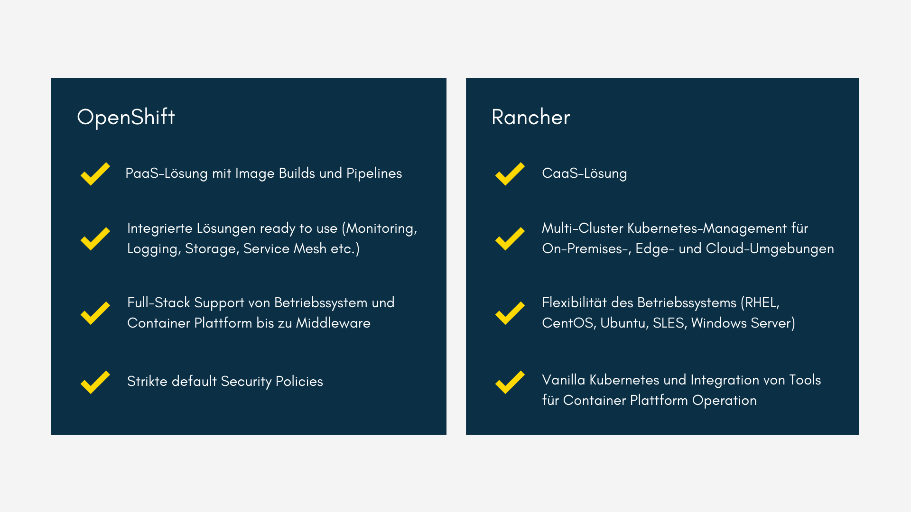

### OpenShift

OpenShift von Red Hat ist eine enterprise-grade Kubernetes-Distribution mit dem Ziel, eine stabile und sichere Kubernetes-basierte Plattform zum Betreiben von containerisierten Applikationen zur Verfügung zu stellen. OpenShift setzt dabei auf eine etablierte Kubernetes-Version und ergänzt diese mit weiteren Funktionen. Red Hat OpenShift unterstützt dich in vielen Themen rund um deine Software-Entwicklung. Das Ökosystem rund um Builds, Source-to-Image (S2I) und dem Red Hat Container-Katalog ermöglicht dir schnell und sicher, deine Applikationen für den Betrieb in einem Container zu entwickeln und anschliessend auf OpenShift laufen zu lassen. Nebst Kubernetes setzt OpenShift auf weitere Projekte aus der CNCF Landschaft für Themen wie beispielsweise Monitoring, Logging, Storage und Service Mesh.

### Rancher

Rancher Labs hat das Ziel, Kubernetes auf einer beliebigen Infrastruktur zu betreiben. Dieses Ziel erreichen sie durch ihre eigene Kubernetes-Distribution, ergänzt durch ein webbasiertes Multi-Cluster-Management-Tool. Dieses dient der Administration der eigenen und auch weiteren KubernetesDistributionen. Zudem können auch managed KubernetesAngebote wie diejenigen von Amazon, Google, Microsoft verwaltet werden. Mit Rancher kannst du einem schnellen und unkomplizierten Weg in die Welt der ContainerOrchestrierung folgen und bekommst viel Flexibilität bei der Ausgestaltung der Container-Plattform. Rancher setzt mit ihrer Distribution auf Vanilla Kubernetes und integriert weitere Tools aus der CNCF Landschaft wie beispielsweise Monitoring, Logging und Service Mesh.

### Wie entscheide ich mich?

Je nach Kundenbedürfnis ist die Integration der Rancher- bzw. der OpenShift-Distrubtion angemessen. Die untenstehenden Stories sollen dich bei der Entscheidung unterstützen. Zögere nicht, unsere Experten zu fragen, falls du dir nicht sicher bist.

**Container Know-how bei den Nutzern**

_Wie hoch ist das Know-how der Entwickler über Containerisierung und wie viel soll noch aufgebaut werden?_

Falls sich deine Entwickler trotz neu eingeführter Container-Technologie weiterhin nur auf die Applikationsentwicklung konzentrieren möchten, sind die OpenShift-Funktionalitäten wie Source-to-Image, CI/CD oder Universal Base Images von Vorteil. Mit zusätzlichem Aufwand können diese Features auch mit Rancher aufgebaut werden.

**Multi-ClusterManagement**

_Werden mehrere Cluster aufgebaut und sollen diese zentral verwaltet werden?_

Rancher Labs legt den Fokus auf Multi-Cluster-Management mit Integration von Kubernetes Cluster sowohl On-Premises als auch in beliebigen CloudUmgebungen. Red Hat bietet mit dem Advanced Cluster Management ebenfalls eine Lösung zum Verwalten mehrer Cluster an, welche jedoch noch in den Anfängen steht.

**Full Stack vs. Flexibilität**

_Was ist für dich zentraler - der Support auf dem ganzen Applikations-Stack oder die Flexibilität bei der Wahl der eingesetzten Komponenten?_

Red Hat bietet Support auf dem ganzen Applikations-Stack – vom OS, über die Container-Plattform und der Middleware, bis hin zum eingesetzen Container Image (Universal Base Image). Um diesen Support zu gewährleisten, sind die eingesetzten Komponenten vorgegeben.

Rancher bietet Support auf der Container-Plattform und den mitgelieferten Komponenten. Bei OS und auf der Plattform aufbauenden Lösungen hast du freie Wahl und somit maximale Flexibilität.

Sowohl Red Hat als auch Rancher investieren viel Zeit in das Testing der eingesetzten Komponenten, um ein reibungsloses Zusammenspiel der ganzen Plattform zu garantieren.

**Linux Distribution**

_Welche Linux Distribution hast du aktuell im Einsatz?_

Besteht in deinem Unternehmen bereits Know-how einer Distribution und einem Tooling für den Betrieb? Rancher bietet Support für CentOS, Oracle Linux, RancherOS, RHEL, Ubuntu und Windows Server. Bei OpenShift wird Red Hat CoreOS bzw. Red Hat Enterprise Linux vorausgesetzt.

**Subscriptions**

_Wie sieht das Subscription- und Support-Modell der beiden Plattformen aus?_

Das Subscription-Modell von Red Hat OpenShift basiert auf Anzahl verwendeter Cores der Compute Nodes. Bei Rancher wird die Control Plane und die Anzahl damit verwalteter Nodes lizenziert.

Hast du Fragen? Zögere nicht, uns unter [hello@appuio.ch](mailto:hello@appuio.ch) zu kontaktieren.

